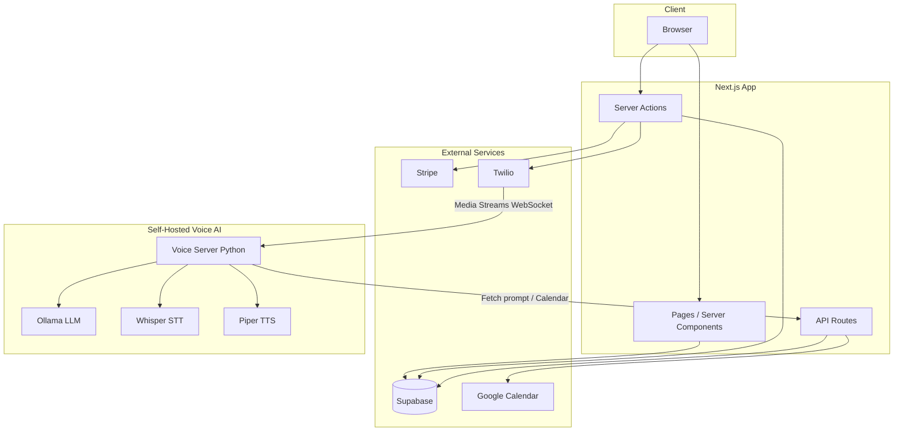

# Echodesk Architecture

High-level architecture for the AI receptionist subscription platform.

## Overview

## Data Flow

### Signup and Subscription

1. User signs up (email/password or Google OAuth) via Supabase Auth
2. User selects plan on dashboard → Stripe Checkout
3. Stripe webhook (`/api/stripe/webhook`) updates `users.subscription_status`, `billing_plan`
4. User completes onboarding: Google Calendar OAuth, creates receptionist

### Receptionist Creation

1. User submits Add Receptionist wizard
2. `createReceptionist` action provisions Twilio number (or uses own number)
3. Receptionist row inserted in `receptionists` with `twilio_phone_number`, `inbound_phone_number`
4. Twilio number configured with voice webhook → `TWILIO_WEBHOOK_BASE_URL/api/twilio/voice`

### Incoming Call

1. Caller dials receptionist number → Twilio receives call
2. Twilio POSTs to `/api/twilio/voice` with `To` (called number)
3. Voice route looks up receptionist by `To` via `getReceptionistByPhoneNumber`
4. **Streams mode** (`TWILIO_VOICE_MODE=streams`): Twilio connects WebSocket to `VOICE_SERVER_WS_URL`
5. Voice server fetches prompt from `/api/receptionist-prompt`, runs Whisper → Ollama → Piper
6. Calendar actions (check availability, create appointment) via `/api/voice/calendar`
7. On stream end, Twilio calls `/api/twilio/status` → `call_usage` row inserted

## Key Tables

| Table | Purpose |
|-------|---------|
| `users` | Auth, subscription_status, billing_plan, calendar_refresh_token |
| `receptionists` | Per-business AI: name, phone numbers, calendar_id, settings |
| `call_usage` | Call logs: duration, cost, transcript (for billing and analytics) |
| `staff`, `services`, `locations`, `promos` | Receptionist-specific configuration |

## Key Files

- `app/api/twilio/voice/route.ts` — Incoming call webhook, routes to Media Streams or Gather
- `app/api/twilio/status/route.ts` — Call end callback, inserts call_usage
- `app/api/receptionist-prompt/route.ts` — Fetches built prompt for voice server
- `app/api/voice/calendar/route.ts` — Google Calendar actions (check, create, reschedule)
- `voice-ai/call_server.py` — WebSocket server: Whisper → Ollama → Piper
- `app/lib/buildReceptionistPrompt.ts` — Builds system prompt from receptionist data
