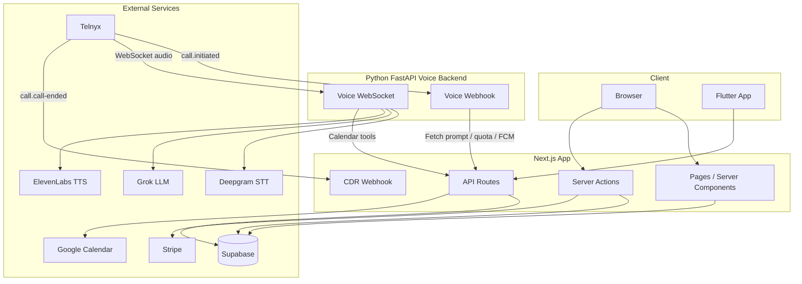

# Echodesk Architecture

High-level architecture for the AI receptionist subscription platform.

## Overview



## Data Flow

### Signup and Subscription

1. User signs up (email/password or Google OAuth) via Supabase Auth
2. User selects plan on dashboard → Stripe Checkout (Starter, Pro, Business, or PAYG)
3. Stripe webhook updates `users` and upserts `user_plans` with allocated inbound/outbound minutes
4. User completes onboarding: Google Calendar OAuth, creates receptionist

### Receptionist Creation

1. User submits Add Receptionist wizard
2. `createReceptionist` provisions Telnyx DID (or configures bring-your-own)
3. Receptionist row inserted with `telnyx_phone_number`, `inbound_phone_number`
4. Telnyx number configured with voice webhook → `TELNYX_WEBHOOK_BASE_URL/api/telnyx/voice`

### Incoming Call

1. Caller dials DID → Telnyx receives call
2. Telnyx webhooks `call.initiated` to the **FastAPI backend** at `/api/telnyx/voice`
3. Backend checks inbound quota (via Next.js internal API), sends FCM push, answers call, starts Telnyx streaming
4. Telnyx connects WebSocket to **FastAPI backend** at `/api/voice/stream`
5. Voice pipeline (in backend): Deepgram STT → Grok LLM → ElevenLabs TTS (ulaw 8kHz)
6. Calendar actions via Next.js `/api/voice/calendar` (called by backend with `VOICE_SERVER_API_KEY`)
7. On hangup, Telnyx CDR webhook → **Next.js** `/api/telnyx/cdr` → `call_usage` insert, `call_ended` FCM push

## Key Tables

| Table | Purpose |
|-------|---------|
| `users` | Auth, subscription_status, billing_plan |
| `user_plans` | Allocated inbound/outbound minutes, overage rate, PAYG rate |
| `receptionists` | Per-business AI: name, telnyx_phone_number, calendar_id |
| `call_usage` | Call logs: duration, direction, overage_flag, billed_minutes |
| `usage_snapshots` | Per-receptionist per-period: total_seconds, overage_minutes, payg_minutes |

## Key Files

| Component | Path |
|-----------|------|
| Voice webhook + WebSocket | `backend/main.py`, `backend/telnyx/voice_webhook.py`, `backend/voice/handler.py` |
| Voice pipeline | `backend/voice/pipeline.py`, `backend/voice/deepgram_client.py`, `backend/voice/grok_client.py`, `backend/voice/elevenlabs_client.py` |
| CDR webhook | `app/api/telnyx/cdr/route.ts` |
| Prompt API | `app/api/receptionist-prompt/route.ts` |
| Calendar API | `app/api/voice/calendar/route.ts` |
| Internal APIs (FCM, quota) | `app/api/internal/send-call-push/route.ts`, `app/api/internal/check-inbound-quota/route.ts` |

## Running Backend and Next.js Together

```bash
# Terminal 1: Next.js dashboard
npm run dev

# Terminal 2: Python voice backend
cd backend && uvicorn main:app --reload --port 8000
```

Set `TELNYX_WEBHOOK_BASE_URL` to the public URL of the FastAPI backend (e.g. `http://localhost:8000` for local, or `https://voice.echodesk.us` in production).

See [MIGRATION.md](../MIGRATION.md) for deployment and env setup.

## Scaling Considerations

**Prompt cache**: The voice pipeline uses an in-memory prompt cache (`prompts/fetch.py`) keyed by `call_control_id`. With a single FastAPI process this works: the webhook pre-fetches the prompt and the WebSocket handler reads it instantly. With multiple instances behind a load balancer, the webhook may hit instance A while the WebSocket connects to instance B; instance B falls back to an HTTP fetch to Next.js `/api/receptionist-prompt`, adding latency. For production multi-instance deployments, consider a shared cache (e.g. Redis) or sticky sessions.
