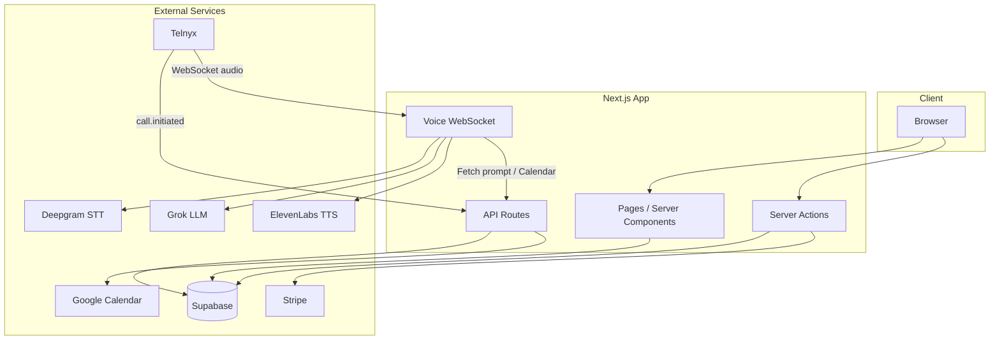

# Echodesk Architecture

High-level architecture for the AI receptionist subscription platform.

## Overview

## Data Flow

### Signup and Subscription

1. User signs up (email/password or Google OAuth) via Supabase Auth
2. User selects plan on dashboard → Stripe Checkout (Starter, Pro, Business, or PAYG)
3. Stripe webhook updates `users` and upserts `user_plans` with allocated inbound/outbound minutes
4. User completes onboarding: Google Calendar OAuth, creates receptionist

### Receptionist Creation

1. User submits Add Receptionist wizard
2. `createReceptionist` provisions Telnyx DID (or configures bring-your-own)
3. Receptionist row inserted with `telnyx_phone_number`, `inbound_phone_number`
4. Telnyx number configured with voice webhook → `TELNYX_WEBHOOK_BASE_URL/api/telnyx/voice`

### Incoming Call

1. Caller dials DID → Telnyx receives call
2. Telnyx webhooks `call.initiated` to `/api/telnyx/voice`
3. Next.js answers call and starts stream to WebSocket at `/api/voice/stream`
4. Voice pipeline: Deepgram STT → Grok LLM → ElevenLabs TTS (ulaw 8kHz)
5. Calendar actions via `/api/voice/calendar`
6. On hangup, Telnyx CDR webhook → `/api/telnyx/cdr` → `call_usage` insert

## Key Tables

| Table | Purpose |
|-------|---------|
| `users` | Auth, subscription_status, billing_plan |
| `user_plans` | Allocated inbound/outbound minutes, overage rate, PAYG rate |
| `receptionists` | Per-business AI: name, telnyx_phone_number, calendar_id |
| `call_usage` | Call logs: duration, direction, overage_flag, billed_minutes |
| `usage_snapshots` | Per-receptionist per-period: total_seconds, overage_minutes, payg_minutes |

## Key Files

- `app/api/telnyx/voice/route.ts` — Incoming call webhook, answer + stream to WebSocket
- `app/api/telnyx/cdr/route.ts` — CDR webhook, inserts call_usage
- `app/api/voice/stream` — WebSocket handler (via server.js)
- `server/voiceStreamHandler.ts` — Voice pipeline: Deepgram → Grok → ElevenLabs
- `app/api/receptionist-prompt/route.ts` — Fetches built prompt for voice pipeline
- `app/api/voice/calendar/route.ts` — Google Calendar actions
