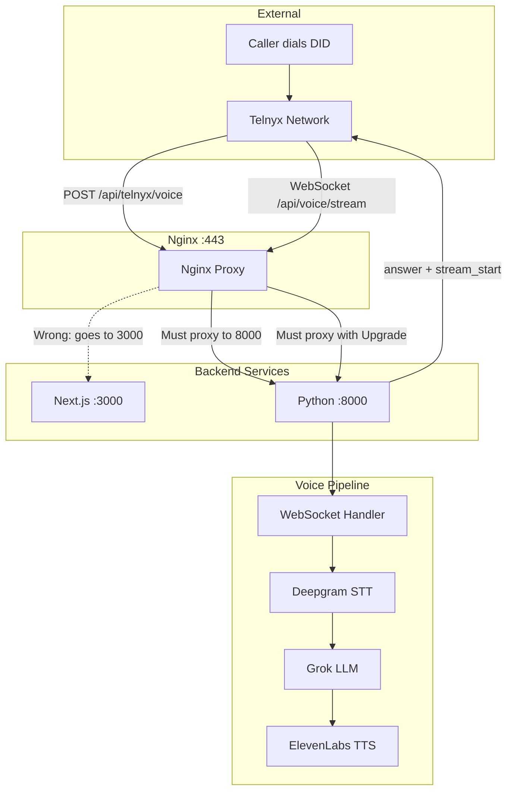

# Call Flow Audit – Callbot (echodesk.us)

End-to-end audit of the incoming call flow from Telnyx DID to voice pipeline. Use this when **incoming calls are not answered** and there is no activity in PM2 logs.

## Call Flow Diagram



## 1. End-to-End Call Flow and Failure Points

| Step | Expected | Failure Point | How to Verify |
|------|----------|---------------|---------------|
| 1. Telnyx receives call | Caller dials DID → Telnyx | DID not provisioned or wrong Connection | Telnyx Portal: Messaging → Numbers |
| 2. Telnyx POST webhook | `POST https://echodesk.us/api/telnyx/voice` | **Nginx routes to Next.js (3000)** → HTML 404 | `curl -X POST https://echodesk.us/api/telnyx/voice -H "Content-Type: application/json" -d '{}'` → expects JSON, not HTML |
| 3. Backend answers | Python answers + `stream_start(stream_url)` | No receptionist, quota exceeded, 403 signature, missing keys | `pm2 logs callbot-voice` for errors |
| 4. Telnyx WebSocket | `wss://echodesk.us/api/voice/stream?...` | **TELNYX_WEBHOOK_BASE_URL wrong** (e.g. localhost → ws://localhost:8000) | Telnyx cannot reach localhost; no WS connect in logs |
| 5. Nginx proxies WS | `/api/voice/` → 8000 with Upgrade | Missing Upgrade/Connection headers | WS fails even if backend up |
| 6. Pipeline runs | Deepgram → Grok → ElevenLabs | Missing API keys, startup validation fails | `callbot-voice` may crash on start |

## 2. Routing Analysis

**Where does `/api/telnyx/voice` go?**

- **Correct:** Nginx `location /api/telnyx/voice` → `proxy_pass http://127.0.0.1:8000` → Python
- **Broken:** `location /` before voice blocks, or no voice block → Next.js (3000)

Next.js has no `/api/telnyx/voice` route – only `cdr` and `outbound`. A request to Next.js returns an HTML 404 page.

**Required nginx layout** (see [nginx-callbot-complete.conf](nginx-callbot-complete.conf)):

- `location ^~ /api/telnyx/voice` → 8000 (the `^~` modifier forces highest priority; without it, requests can fall through to `location /`)
- `location ^~ /api/voice/` → 8000 with `Upgrade` / `Connection`
- `location /` → 3000

If voice blocks lack `^~` or `location /` is defined first, `/api/telnyx/voice` can hit Next.js and return HTML.

**Critical:** The deploy workflow does **not** deploy nginx. Nginx is a one-time manual step per [deployment.md](deployment.md). The live VPS nginx config may differ from the repo.

## 3. PM2 and Log Locations

| PM2 App | Port | Purpose | Where Voice Logs Appear |
|---------|------|---------|-------------------------|
| `callbot` | 3000 | Next.js dashboard, `/api/telnyx/outbound`, `/api/telnyx/cdr` | No – voice is in callbot-voice |
| `callbot-voice` | 8000 | `/api/telnyx/voice`, `/api/voice/stream` | Yes – all voice webhook and pipeline logs |

**Symptom "No activity in PM2 logs":** You may be checking `pm2 logs callbot`. Voice events go to `pm2 logs callbot-voice`. If callbot-voice is not running, there are no voice logs.

## 4. Receptionist Lookup

The webhook in `backend/telnyx/voice_webhook.py` calls `_get_receptionist_by_phone(supabase, to_number)` using the **To** number (the DID being called).

- Lookup order: `telnyx_phone_number` then `inbound_phone_number`, both must match `status = 'active'`
- Phone variants: E.164, +1, 10-digit (see `backend/utils/phone.py`)
- Fallback: if no match, uses first active receptionist (with warning)
- Quota: before answering, backend calls `APP_API_BASE_URL/api/internal/check-inbound-quota` – if `allowed: false`, call is rejected

**Verify in Supabase:**

```sql
SELECT id, name, telnyx_phone_number, inbound_phone_number, status
FROM receptionists WHERE status = 'active';
```

## 5. Environment Variables (VPS)

| Variable | Purpose | Impact if Wrong/Missing |
|----------|---------|-------------------------|
| `TELNYX_WEBHOOK_BASE_URL` | Used to build `stream_url` in `get_telnyx_ws_base()` | Defaults to `http://localhost:8000` → `ws://localhost:8000` – Telnyx cannot connect |
| `TELNYX_API_KEY` | Answer + stream_start API calls | 503, call not answered |
| `TELNYX_PUBLIC_KEY` or `TELNYX_WEBHOOK_SECRET` | Webhook verification | Invalid signature → 403 |
| `DEEPGRAM_API_KEY`, `GROK_API_KEY`, `ELEVENLABS_API_KEY` | Voice pipeline | Backend fails validation at startup |
| `APP_API_BASE_URL`, `INTERNAL_API_KEY` | Quota check, FCM push | Quota/push fail; call still answered if quota passes |

Deploy workflow does not copy `.env`/`.env.local` from the repo. These must exist on the VPS and be loaded by PM2 (ecosystem loads them via dotenv).

## 6. Telnyx Portal Configuration

- **Event Webhook URL:** `https://echodesk.us/api/telnyx/voice` (Voice API Application)
- **HTTPS required** – Telnyx will not use HTTP for webhooks
- If nginx is HTTP-only (no SSL), webhooks will fail

## 7. Root-Cause Checklist (Ordered by Likelihood)

1. **Nginx routes voice to Next.js**
   - Cause: Voice `location` blocks missing or after `location /`
   - Evidence: `curl -X POST https://echodesk.us/api/telnyx/voice -d '{}'` returns HTML
   - Fix: Use [nginx-callbot-complete.conf](nginx-callbot-complete.conf) or run `deploy/scripts/fix-nginx-voice.sh`

2. **callbot-voice not running**
   - Cause: Only `callbot` started, or voice process crashed (e.g. missing keys)
   - Evidence: `pm2 list` shows no callbot-voice; port 8000 not listening
   - Fix: `pm2 start ecosystem.config.cjs` (runs both apps)

3. **TELNYX_WEBHOOK_BASE_URL missing or wrong on VPS**
   - Cause: Default `http://localhost:8000` used for `stream_url`
   - Evidence: No WebSocket connect in `pm2 logs callbot-voice`; "Answered" and "Stream started" present
   - Fix: Set `TELNYX_WEBHOOK_BASE_URL=https://echodesk.us` in VPS `.env`/`.env.local`, then `pm2 reload callbot-voice --update-env`

4. **HTTP-only nginx (no SSL)**
   - Cause: Using `callbot-http-only.conf.template` or no cert
   - Evidence: Telnyx cannot POST to `http://echodesk.us` (needs HTTPS)
   - Fix: Obtain cert (e.g. `certbot certonly`) and use HTTPS nginx config

5. **Receptionist lookup fails**
   - Cause: DID not in `telnyx_phone_number`/`inbound_phone_number` or format mismatch
   - Evidence: "No receptionist for DID" in logs; fallback used or reject
   - Fix: Align `telnyx_phone_number` / `inbound_phone_number` with Telnyx DID format

6. **Telnyx Portal webhook URL wrong**
   - Cause: Event webhook points to wrong path or domain
   - Evidence: No POST to backend when call arrives
   - Fix: Portal → Voice API Application → Event Webhook URL: `https://echodesk.us/api/telnyx/voice`

## 8. Quick Diagnostics

Run the [diagnostic script](../deploy/scripts/diagnose-call-flow.sh) on the VPS:

```bash
./deploy/scripts/diagnose-call-flow.sh
```

Or run manually:

```bash
# 1. PM2 status
pm2 list

# 2. Voice logs (where webhook/pipeline activity appears)
pm2 logs callbot-voice --lines 50

# 3. Port 8000 listening
ss -tlnp | grep 8000

# 4. Backend health
curl -s http://127.0.0.1:8000/health

# 5. Nginx routing (expect JSON, not HTML)
curl -s -X POST https://echodesk.us/api/telnyx/voice \
  -H "Content-Type: application/json" \
  -d '{}'

# 6. Active nginx config
sudo cat /etc/nginx/sites-enabled/callbot

# 7. Nginx config check
sudo nginx -t

# 8. TELNYX_WEBHOOK_BASE_URL on VPS
grep TELNYX_WEBHOOK_BASE_URL .env .env.local 2>/dev/null
```

## 9. Concrete Fixes

| Issue | Action |
|-------|--------|
| Nginx 404 on voice | Run `./deploy/scripts/fix-nginx-voice.sh` or copy [nginx-callbot-complete.conf](nginx-callbot-complete.conf) to `/etc/nginx/sites-available/callbot`, enable, then `sudo nginx -t && sudo systemctl reload nginx` |
| callbot-voice not running | `pm2 start ecosystem.config.cjs` or `pm2 start "backend/start.sh" --name callbot-voice` |
| `TELNYX_WEBHOOK_BASE_URL` wrong | Add to `.env.local`: `TELNYX_WEBHOOK_BASE_URL=https://echodesk.us`, then `pm2 reload callbot-voice --update-env` |
| No SSL | Use `certbot certonly --standalone -d echodesk.us` then switch to `deploy/nginx/callbot.conf.template` |
| Receptionist mismatch | Fix `telnyx_phone_number` / `inbound_phone_number` in Supabase to match Telnyx DID (E.164, +1, etc.) |
| Portal URL wrong | Set Event Webhook URL in Telnyx Portal to `https://echodesk.us/api/telnyx/voice` |
