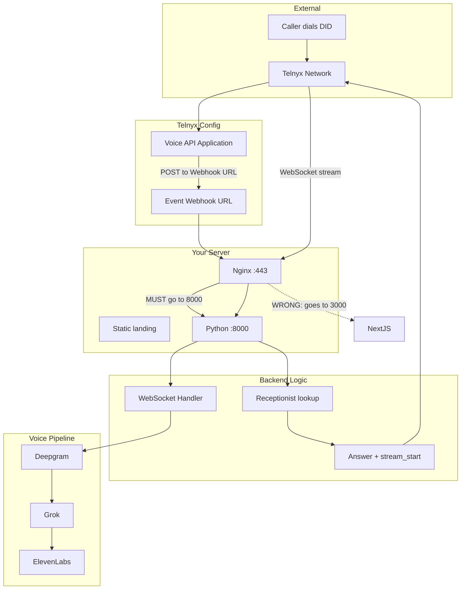

# Call Flow Chain – Where It Can Fail

**Canonical call-flow reference.** When you call the Telnyx number and it doesn't pick up, the failure is somewhere in this chain. Use this guide to trace it.

See also: [FULL_PROJECT_OVERVIEW.md](FULL_PROJECT_OVERVIEW.md) for architecture and deployment.

## Quick Recovery

On the VPS, from project root:

```bash
./deploy/scripts/restore-call-flow.sh
```

This restarts callbot-voice, fixes nginx voice routing, and runs diagnostics.

## End-to-End Flow



## Failure Points (Most Likely First)

### 1. Telnyx Voice API Application – Wrong Webhook URL

**Symptom:** Call rings but never answers. No activity in `pm2 logs callbot-voice`.

**Cause:** Your numbers are on a Voice API Application whose Event Webhook URL points to an **old URL** (e.g. different domain or localhost).

**Fix:**
1. [Telnyx Portal](https://portal.telnyx.com) → **Real-Time Communications** → **Voice** → **Voice API Applications**
2. Open the application that your numbers use
3. Set **Event Webhook URL** to: `https://echodesk.us/api/telnyx/voice`
4. Save

---

### 2. Nginx – Voice Routed to Next.js Instead of Python

**Symptom:** Telnyx sends webhooks but gets HTML/404. No Python logs.

**Cause:** Nginx sends `/api/telnyx/voice` to the wrong target (e.g. static files). Returns HTML instead of JSON.

**Verify:**
```bash
curl -s -X POST https://echodesk.us/api/telnyx/voice -H "Content-Type: application/json" -d '{}' | head -c 200
```
- **Bad:** `<html>`, `<!DOCTYPE` → Nginx routing to static/HTML
- **Good:** `{"success":true}` or similar JSON

**Fix:** Run on VPS:
```bash
./deploy/scripts/fix-nginx-voice.sh
```

---

### 3. callbot-voice Not Running

**Symptom:** Port 8000 not listening. No Python logs at all.

**Verify:**
```bash
pm2 list
ss -tlnp | grep 8000
curl -s http://127.0.0.1:8000/health
```

**Fix:** Start the full stack:
```bash
pm2 start ecosystem.config.cjs
```

---

### 4. TELNYX_WEBHOOK_BASE_URL Wrong (Stream URL)

**Symptom:** Webhook is received, "Answered" appears in logs, but call drops or no audio. No WebSocket connect.

**Cause:** Python builds `stream_url` from `TELNYX_WEBHOOK_BASE_URL`. If it's `http://localhost:8000`, Telnyx tries `ws://localhost:8000/...` from their servers and fails.

**Fix:** In `.env` or `.env.local` on VPS:
```
TELNYX_WEBHOOK_BASE_URL=https://echodesk.us
```
Then: `pm2 reload callbot-voice --update-env`

---

### 5. Receptionist Lookup Fails

**Symptom:** Logs show "No receptionist for DID" or fallback. Call may still work via fallback, but can cause issues.

**Cause:** `telnyx_phone_number` or `inbound_phone_number` in Supabase doesn't match the DID format Telnyx sends (E.164, +1, etc.).

**Verify in Supabase:**
```sql
SELECT id, name, telnyx_phone_number, inbound_phone_number, status
FROM receptionists WHERE status = 'active';
```

Match formats: E.164 (`+1XXXXXXXXXX`), 10-digit, etc. See `backend/utils/phone.py` for lookup variants.

---

### 6. Webhook Verification Fails (403)

**Symptom:** Telnyx gets 403. Logs may show signature verification failure or "telnyx-signature-ed25519/telnyx-timestamp headers missing".

**Cause:** `TELNYX_PUBLIC_KEY` or `TELNYX_WEBHOOK_SECRET` is wrong/not set, or Cloudflare/proxy strips the verification headers.

**Fixes:**
- Telnyx Portal → Account → Public Key. Add `TELNYX_PUBLIC_KEY=<base64>` to VPS env. Reload: `pm2 reload callbot-voice --update-env`
- **Cloudflare workaround:** Set `TELNYX_SKIP_VERIFY=1` to accept webhooks without signature verification when headers are stripped. Less secure; use only as a last resort.

---

### 7. Inbound Quota Exceeded

**Symptom:** Call rejected. Logs: "Inbound quota exceeded for user X".

**Cause:** User has used their plan's included minutes.

**Fix:** Check usage in dashboard; upgrade plan or wait for reset.

---

### 8. Call Answered but Silence (WebSocket 403 / Stream Failed)

**Symptom:** Call answers, then silence. Logs show:
- `Answered call <id>` ✓
- `WebSocket /api/voice/stream... 403` and `connection rejected (403 Forbidden)`
- `Stream start failed: "Failed to connect to destination"` (Telnyx code 90046)

**Cause:** Telnyx connects to the stream URL (`wss://echodesk.us/api/voice/stream?...`) to send/receive audio. The WebSocket is being rejected. Common causes:

1. **Nginx not routing /api/voice/** – WebSocket goes to wrong target. Run `./deploy/scripts/sync-nginx-config.sh` so `location ^~ /api/voice/` proxies to port 8000.
2. **Cloudflare Tunnel** – Cloudflare Tunnel can block or mishandle WebSocket upgrades. Use a direct connection for the stream:
   - Add a DNS A record for a subdomain (e.g. `stream.echodesk.us`) pointing to your VPS IP.
   - Set `TELNYX_STREAM_BASE_URL=https://stream.echodesk.us` so Telnyx connects directly to your server, bypassing the tunnel.

**Verify:** Check `pm2 logs callbot-voice` for `Stream URL for <id>: wss://...` – that is the URL Telnyx uses. It must be reachable from the internet and route to the Python backend.

---

## Cloudflare Tunnel Bypassing Nginx

**Symptom:** `fix-nginx-voice.sh` ran successfully, but `curl https://echodesk.us/api/telnyx/voice` still returns HTML. Localhost test (`curl -sk https://127.0.0.1/api/telnyx/voice -H "Host: echodesk.us"`) returns JSON.

**Cause:** Traffic reaches your server via **Cloudflare Tunnel** (cloudflared). The tunnel may be configured to forward `echodesk.us` to the wrong port, bypassing nginx.

**Fix:** Update your Cloudflare Tunnel ingress configuration. Point the tunnel at **nginx** (port 80 or 443):

```yaml
# config.yml - tunnel ingress
ingress:
  - hostname: echodesk.us
    service: http://127.0.0.1:80    # nginx, NOT :3000
  - service: http_status:404
```

Then restart the tunnel: `sudo systemctl restart cloudflared` (or equivalent).

---

## Pre-Migration Accounts

If the account and assistant were created **before** switching to Flutter + Python:

1. **Telnyx webhook** – Almost certainly still points to the old stack. Update the Voice API Application Event Webhook URL (step 1 above).
2. **Nginx** – May never have been updated to route voice to Python. Run `fix-nginx-voice.sh` (step 2).
3. **Receptionist** – Should still work; lookup uses `telnyx_phone_number` / `inbound_phone_number`. Verify in Supabase.

---

## Quick Diagnostic

Run on the VPS from project root:

```bash
./deploy/scripts/diagnose-call-flow.sh
```

Then check voice logs:

```bash
pm2 logs callbot-voice --lines 50
```

When you place a test call, watch for:
- `Answered call <id>` – webhook reached Python and answered
- `Stream started for <id>` – Telnyx connected to WebSocket
- Any errors (403, 503, receptionist not found, etc.)
