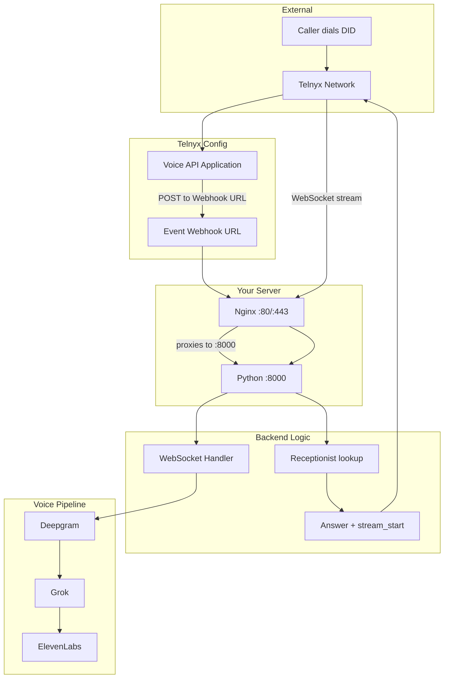

# Call Flow Chain – Where It Can Fail

**Canonical call-flow reference.** When you call the Telnyx number and it doesn't pick up, the failure is somewhere in this chain. Use this guide to trace it.

See also: [FULL_PROJECT_OVERVIEW.md](FULL_PROJECT_OVERVIEW.md) for architecture and deployment.

**For 90046 / silence after answer:** Run the [bulletproof fix](90046-BULLETPROOF-FIX.md) – `./deploy/scripts/fix-90046-bulletproof.sh`

## Quick Recovery

On the VPS, from project root:

```bash
./deploy/scripts/restore-call-flow.sh
```

This restarts callbot-voice, fixes nginx voice routing, and runs diagnostics.

## End-to-End Flow



## Failure Points (Most Likely First)

### 1. Telnyx Voice API Application – Wrong Webhook URL

**Symptom:** Call rings but never answers. No activity in `pm2 logs callbot-voice`.

**Cause:** Your numbers are on a Voice API Application whose Event Webhook URL points to an **old URL** (e.g. different domain or localhost).

**Fix:** The URL must be the **full path** including `/api/telnyx/voice` (the backend registers this route in `main.py`):
1. [Telnyx Portal](https://portal.telnyx.com) → **Real-Time Communications** → **Voice** → **Voice API Applications**
2. Open the application that your numbers use
3. Set **Event Webhook URL** to: `https://echodesk.us/api/telnyx/voice`
4. Save

---

### 2. Nginx – Voice Routed to Wrong Target

**Symptom:** Telnyx sends webhooks but gets HTML/404. No Python logs.

**Cause:** Nginx sends `/api/telnyx/voice` to the wrong target (e.g. static files instead of Python). Returns HTML instead of JSON. The deploy nginx config proxies to port 8000; if you have custom/old config, it may point elsewhere.

**Verify:**
```bash
curl -s -X POST https://echodesk.us/api/telnyx/voice -H "Content-Type: application/json" -d '{}' | head -c 200
```
- **Bad:** `<html>`, `<!DOCTYPE` → Nginx routing to static/HTML
- **Good:** `{"success":true}` or similar JSON

**Fix:** Run on VPS:
```bash
./deploy/scripts/fix-nginx-voice.sh
```

---

### 3. callbot-voice Not Running

**Symptom:** Port 8000 not listening. No Python logs at all.

**Verify** (run on the VPS – `127.0.0.1` is localhost, no DNS needed):
```bash
pm2 list
ss -tlnp | grep 8000
curl -s http://127.0.0.1:8000/health
```
Expected: `{"status":"ok","supabase":"ok"}`. DNS (echodesk.us → VPS IP) is for external traffic; nginx proxies to 127.0.0.1:8000 internally.

**Fix:** Start the full stack:
```bash
pm2 start ecosystem.config.cjs
```

---

### 4. TELNYX_WEBHOOK_BASE_URL Wrong (Stream URL)

**Symptom:** Webhook is received, "Answered" appears in logs, but call drops or no audio. No WebSocket connect.

**Cause:** Python builds `stream_url` from `TELNYX_WEBHOOK_BASE_URL`. If it's `http://localhost:8000`, Telnyx tries `ws://localhost:8000/...` from their servers and fails.

**Fix:** In `.env` or `.env.local` on VPS:
```
TELNYX_WEBHOOK_BASE_URL=https://echodesk.us
```
Then: `pm2 reload callbot-voice --update-env`

---

### 5. Receptionist Lookup Fails

**Symptom:** Logs show "No receptionist for DID" or fallback. Call may still work via fallback, but can cause issues.

**Cause:** `telnyx_phone_number` or `inbound_phone_number` in Supabase doesn't match the DID format Telnyx sends.

**DID format (E.164):** Telnyx sends the called number as E.164, e.g. `+16176137764`. The lookup tries:
- `telnyx_phone_number` (preferred – your Telnyx DID)
- `inbound_phone_number` (fallback)

**Accepted formats** (any of these in the DB will match):
- `+16176137764` (E.164)
- `16176137764`
- `6176137764` (10-digit US)

**Verify in Supabase:**
```sql
SELECT id, name, telnyx_phone_number, inbound_phone_number, status
FROM receptionists WHERE status = 'active';
```

At least one of `telnyx_phone_number` or `inbound_phone_number` must match the DID you configured in Telnyx for that number.

---

### 6. Webhook Verification Fails (403)

**Symptom:** Telnyx gets 403. Logs may show signature verification failure or "telnyx-signature-ed25519/telnyx-timestamp headers missing".

**Cause:** `TELNYX_PUBLIC_KEY` or `TELNYX_WEBHOOK_SECRET` is wrong/not set, or **Cloudflare/proxy strips the verification headers** (most common when using Cloudflare Tunnel or Cloudflare Proxy).

**Fixes:**
- Telnyx Portal → Account → Public Key. Add `TELNYX_PUBLIC_KEY=<base64>` to VPS env. Reload: `pm2 delete callbot-voice && pm2 start ecosystem.config.cjs`
- **Cloudflare workaround:** Set `TELNYX_SKIP_VERIFY=1` to accept webhooks when headers are stripped. Less secure; use `TELNYX_ALLOWED_IPS` for defense-in-depth.

**Do you need Cloudflare?** No. Cloudflare provides DDoS protection, SSL, CDN, but it can strip Telnyx headers and break WebSockets (90046). You can:
- **Option A:** Keep Cloudflare for echodesk.us (webhooks), use `TELNYX_SKIP_VERIFY=1`, and use `stream.echodesk.us` (DNS-only, direct to VPS) for the media stream.
- **Option B:** Point echodesk.us directly to your VPS (A record, no proxy). Use Let's Encrypt on the VPS for SSL. No Cloudflare in the path = no header stripping, WebSocket works.

---

### 7. Inbound Quota Exceeded

**Symptom:** Call rejected. Logs: "Inbound quota exceeded for user X".

**Cause:** User has used their plan's included minutes.

**Fix:** Check usage in dashboard; upgrade plan or wait for reset.

---

### 8. Call Answered but Silence (WebSocket 403 / Stream Failed – Telnyx 90046)

**Symptom:** Call answers, then silence. Logs show:
- `Answered call <id>` ✓
- `"WebSocket /api/voice/stream..." 403` and `connection rejected (403 Forbidden)`
- `Stream start failed: "Failed to connect to destination"` (Telnyx code 90046)

**Cause:** Telnyx connects to the stream URL (`wss://.../api/voice/stream?...`) to send/receive audio. The **403** means the WebSocket upgrade is being rejected. Common causes:

1. **Using `echodesk.us` through Cloudflare Proxy** – Webhooks (HTTP POST) work, but Cloudflare can reject WebSocket upgrades (403) via WAF, Security Level, or Bot Fight Mode. Telnyx must connect **directly** to your server for the stream (e.g. `stream.echodesk.us` with DNS-only).
2. **PM2 still using old env** – If you changed `.env` (e.g. removed `TELNYX_STREAM_BASE_URL`), `pm2 restart` does **not** reload env. You must fully restart.
3. **Nginx not routing /api/voice/** – WebSocket goes to wrong target.
4. **stream.echodesk.us not set up** – DNS, cert, or nginx missing for the stream subdomain.

#### Fix: Use a Direct Stream Subdomain (recommended)

Use `stream.echodesk.us` so Telnyx connects **directly** to your VPS, bypassing Cloudflare Tunnel:

1. **DNS:** Add an A record for `stream.echodesk.us` → your VPS IP.  
   - In Cloudflare: create the record with **DNS only** (gray cloud) so traffic goes straight to the VPS, not through the proxy.

2. **SSL cert:** Add the subdomain to your cert:
   ```bash
   sudo certbot certonly --standalone -d echodesk.us -d www.echodesk.us -d stream.echodesk.us --expand
   ```
   Or if using nginx for certbot: `-d stream.echodesk.us` in your cert config.

3. **Nginx:** Ensure `stream.echodesk.us` is in `server_name` for the HTTPS block (see `deploy/nginx/callbot.conf.template`).

4. **Env on VPS** (in `~/apps/callbot/.env`):
   ```
   TELNYX_WEBHOOK_BASE_URL=https://echodesk.us
   TELNYX_STREAM_BASE_URL=https://stream.echodesk.us
   ```

5. **Reload env and restart:**
   ```bash
   cd ~/apps/callbot
   pm2 delete callbot-voice
   pm2 start ecosystem.config.cjs
   ```
   (Use `delete` + `start`, not `restart`, so env is reloaded from `.env`.)

#### If You Don't Use TELNYX_STREAM_BASE_URL

Without it, Python uses `TELNYX_WEBHOOK_BASE_URL` for the stream, so the stream URL becomes `wss://echodesk.us/...`. That only works if `echodesk.us` is reachable for WebSockets (e.g. direct DNS to VPS, no Cloudflare Tunnel). If traffic goes through Cloudflare Tunnel, WebSocket often fails with 90046.

#### Verify

- Run on VPS: `./deploy/scripts/verify-90046-fix.sh` – checks deployed code, env, and nginx.
- Check logs: `pm2 logs callbot-voice` → `Stream URL for <id>: wss://...` – that is what Telnyx uses.
- After a call: look for `[voice/stream] Accepting WebSocket` – if missing, the handler is never reached (old code or routing issue).
- Ensure the stream host (e.g. `stream.echodesk.us`) is reachable from the internet and routes to nginx → port 8000.

#### All Possible Causes of 403 / 422 / 90046

| Cause | Symptom | Fix |
|-------|---------|-----|
| **Cloudflare blocks WebSocket** | 403 when using `wss://echodesk.us` | Use `TELNYX_STREAM_BASE_URL=https://stream.echodesk.us` (DNS-only, direct to VPS) |
| **Nginx http-only (no 443)** | Connection refused to stream URL | Use full SSL config; run `sed "s|{{LANDING_ROOT}}|$PWD/landing/dist|g" deploy/nginx/callbot.conf.template \| sudo tee /etc/nginx/sites-available/callbot` then `sudo nginx -t && sudo systemctl reload nginx` |
| **stream.echodesk.us missing from nginx** | 403 or connection refused | Add to `server_name` in nginx; sync from template |
| **Duplicate WebSocket (Telnyx retry)** | "Rejecting duplicate WebSocket" in logs; 403 | Normal; first connection should succeed. If both fail, check for stale entries in `active_by_call_sid` |
| **Old code (reject before accept)** | 403, no `[voice/stream] Accepting WebSocket` in logs | Pull latest, `pm2 delete callbot-voice && pm2 start ecosystem.config.cjs`. Check for `[startup] Voice backend v2026-03-stream-fix` |
| **Missing voice API keys** | Pipeline init fails after accept | Set DEEPGRAM_API_KEY, GROK_API_KEY, ELEVENLABS_API_KEY in .env |
| **Firewall blocks 443** | Connection timeout from outside | `sudo ufw allow 443/tcp && sudo ufw reload` |

---

## Cloudflare Tunnel Bypassing Nginx

**Symptom:** `fix-nginx-voice.sh` ran successfully, but `curl https://echodesk.us/api/telnyx/voice` still returns HTML. Localhost test (`curl -sk https://127.0.0.1/api/telnyx/voice -H "Host: echodesk.us"`) returns JSON.

**Cause:** Traffic reaches your server via **Cloudflare Tunnel** (cloudflared). The tunnel may be configured to forward `echodesk.us` to the wrong port, bypassing nginx.

**Fix:** Update your Cloudflare Tunnel ingress configuration. Point the tunnel at **nginx** (port 80 or 443):

```yaml
# config.yml - tunnel ingress
ingress:
  - hostname: echodesk.us
    service: http://127.0.0.1:80    # nginx, NOT :3000
  - service: http_status:404
```

Then restart the tunnel: `sudo systemctl restart cloudflared` (or equivalent).

---

## Common Log Messages (Not Necessarily Errors)

| Log | Meaning |
|-----|---------|
| `GET /api/telnyx/voice 405` or `GET /api/telnyx/cdr 405` | Something (health check, bot, browser) sent GET instead of POST. These endpoints only accept POST. **405 = Method Not Allowed.** Harmless. |
| `Shutting down` / `Application shutdown complete` | Normal when running `pm2 reload` or `pm2 restart`. PM2 tells the process to stop, it shuts down, then PM2 starts a new one. |
| `TELNYX_ALLOWED_IPS for defense-in-depth` | A **recommendation** when `TELNYX_SKIP_VERIFY=1`. Webhooks are still accepted (200 OK). Optional: set `TELNYX_ALLOWED_IPS` to restrict which IPs can send webhooks. |
| `FIREBASE_SERVICE_ACCOUNT_KEY not set` | Push notifications for incoming calls are skipped. Calls still work; only the mobile push alert is disabled. |

---

## Pre-Migration Accounts

If the account and assistant were created **before** switching to Flutter + Python:

1. **Telnyx webhook** – Almost certainly still points to the old stack. Update the Voice API Application Event Webhook URL (step 1 above).
2. **Nginx** – May never have been updated to route voice to Python. Run `fix-nginx-voice.sh` (step 2).
3. **Receptionist** – Should still work; lookup uses `telnyx_phone_number` / `inbound_phone_number`. Verify in Supabase.

---

## Quick Diagnostic

Run on the VPS from project root:

```bash
./deploy/scripts/diagnose-call-flow.sh
```

Then check voice logs:

```bash
pm2 logs callbot-voice --lines 50
```

When you place a test call, watch for:
- `Answered call <id>` – webhook reached Python and answered
- `Stream started for <id>` – Telnyx connected to WebSocket
- Any errors (403, 503, receptionist not found, etc.)
