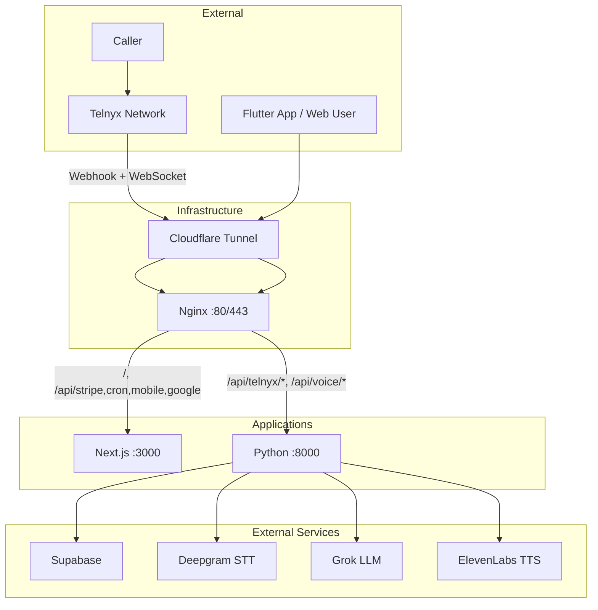

# Callbot / Echodesk – Full Project Overview

AI phone receptionist: **App-first architecture** – Flutter mobile (primary), Python backend (voice + CDR + outbound), minimal Next.js (landing + API for Stripe, cron, mobile, OAuth). This document is the single entry point for architecture, env vars, deployment, and call flow.

## Architecture



### Components

| Component | Port | Purpose |
|-----------|------|---------|
| **callbot** (PM2) | 3000 | Next.js: landing page, `/api/stripe/*`, `/api/cron/*`, `/api/mobile/*`, `/api/google/callback`, `/api/health` |
| **callbot-voice** (PM2) | 8000 | Python FastAPI: `/api/telnyx/voice`, `/api/telnyx/cdr`, `/api/telnyx/outbound`, `/api/voice/stream`, voice pipeline, quota, FCM push |
| **Nginx** | 80, 443 | Reverse proxy: telnyx/voice paths → 8000, rest → 3000 |

### Critical Routing

- `/api/telnyx/voice`, `/api/telnyx/cdr`, `/api/telnyx/outbound`, `/api/voice/*` → **Python** (8000)
- `/`, `/api/stripe/*`, `/api/cron/*`, `/api/mobile/*`, `/api/google/*` → **Next.js** (3000)
- Nginx voice/telnyx locations must be defined **before** the catch-all `/` (use `^~` modifier)
- If Cloudflare Tunnel is used, it must point at **nginx (:80)**, not Next.js (:3000)

---

## Call Flow (Independent of Web/Mobile)

Calls do not depend on the web app or Flutter. The chain is:

1. **Caller** → Telnyx (SIP/VoIP)
2. **Telnyx** → `POST https://echodesk.us/api/telnyx/voice` (webhook)
3. **Nginx** → Python backend (8000)
4. **Python** → Lookup receptionist (Supabase), **local quota check**, answer call, `stream_start(stream_url)`
5. **Telnyx** → WebSocket `wss://echodesk.us/api/voice/stream?...`
6. **Python** → Deepgram (STT) → Grok (LLM) → ElevenLabs (TTS) → audio back to Telnyx
7. Call ends → Telnyx sends CDR to **Python** (`/api/telnyx/cdr`)

**Call flow reference:** [CALL_FLOW_DIAGNOSTIC.md](CALL_FLOW_DIAGNOSTIC.md) – failure points, fixes, diagnostics.

---

## Environment Variables

Single source: `deploy/env/.env.example`. Copy to project root as `.env` or `.env.local`.

### Required for Voice (Backend)

| Variable | Purpose |
|----------|---------|
| `TELNYX_API_KEY` | Answer + stream_start API calls |
| `TELNYX_WEBHOOK_BASE_URL` | Base URL for stream (e.g. `https://echodesk.us`). **Not** localhost. |
| `DEEPGRAM_API_KEY` | Speech-to-text |
| `GROK_API_KEY` | LLM |
| `ELEVENLABS_API_KEY` | Text-to-speech |
| `NEXT_PUBLIC_SUPABASE_URL` or `SUPABASE_URL` | Supabase project URL |
| `SUPABASE_SERVICE_ROLE_KEY` | Backend DB access |

### Required for Outbound (Python)

| Variable | Purpose |
|----------|---------|
| `TELNYX_CONNECTION_ID` | Call Control connection ID for outbound calls |
| `NEXT_PUBLIC_SUPABASE_ANON_KEY` | JWT validation for Bearer token (Flutter outbound) |
| `FIREBASE_SERVICE_ACCOUNT_KEY` | FCM push for incoming/ended calls (JSON string) |

### Optional / Voice

| Variable | Purpose |
|----------|---------|
| `TELNYX_STREAM_BASE_URL` | Direct URL for media stream (bypass Cloudflare if WS blocked) |
| `TELNYX_SKIP_VERIFY` | Skip webhook signature verification (Cloudflare strips headers) |
| `TELNYX_PUBLIC_KEY` / `TELNYX_WEBHOOK_SECRET` | Webhook verification |

### Required for Deploy

| Variable | Purpose |
|----------|---------|
| `NEXT_SERVER_ACTIONS_ENCRYPTION_KEY` | Next.js Server Actions (generate: `openssl rand -base64 32`) |

Full audit: [ENV_AUDIT_REPORT.md](ENV_AUDIT_REPORT.md).

---

## Deployment Flow

### GitHub Actions (Push to main)

1. Checkout code
2. SSH to VPS → `cd $APP_PATH`, `git pull`, `./deploy/scripts/deploy.sh`
3. `deploy.sh`: npm ci, venv + pip, validate env, npm build, PM2 restart

### Deploy Script Steps

1. Check `NEXT_SERVER_ACTIONS_ENCRYPTION_KEY`
2. `npm ci`
3. Create venv, `pip install -r backend/requirements.txt`
4. `npm run validate:env`, `./venv/bin/python scripts/validate-env.py`
5. `npm run build`
6. PM2: delete old processes, `pm2 start ecosystem.config.cjs`
7. `./deploy/scripts/validate-infra-before-start.sh`

### VPS Prerequisites

- Node, pip3, PM2, nginx
- `.env` / `.env.local` in project root
- Nginx voice routing (run `./deploy/scripts/fix-nginx-voice.sh` once)
- Cloudflare Tunnel (if used): ingress → `http://127.0.0.1:80` (nginx)

### Restore Call Flow After Issues

```bash
./deploy/scripts/restore-call-flow.sh
```

See [DEPLOY_CHECKLIST.md](DEPLOY_CHECKLIST.md) for a pre-deploy checklist.

---

## Project Structure

```
├── app/                 # Next.js app router (dashboard, API routes)
├── backend/             # Python FastAPI (voice webhook, WebSocket handler, pipeline)
├── mobile/              # Flutter app (user-facing)
├── deploy/              # Deploy scripts, nginx configs, env template
├── scripts/             # validate-env.py, etc.
├── docs/                # Documentation
└── ecosystem.config.cjs # PM2 config (callbot + callbot-voice)
```

---

## Key Docs

| Doc | Purpose |
|-----|---------|
| [CALL_FLOW_DIAGNOSTIC.md](CALL_FLOW_DIAGNOSTIC.md) | Call flow failure points, fixes, diagnostics |
| [DEPLOY_CHECKLIST.md](DEPLOY_CHECKLIST.md) | Pre-deploy checklist |
| [ENV_AUDIT_REPORT.md](ENV_AUDIT_REPORT.md) | Full env var audit |
| [ARCHITECTURE.md](ARCHITECTURE.md) | Component diagram, data flow |
